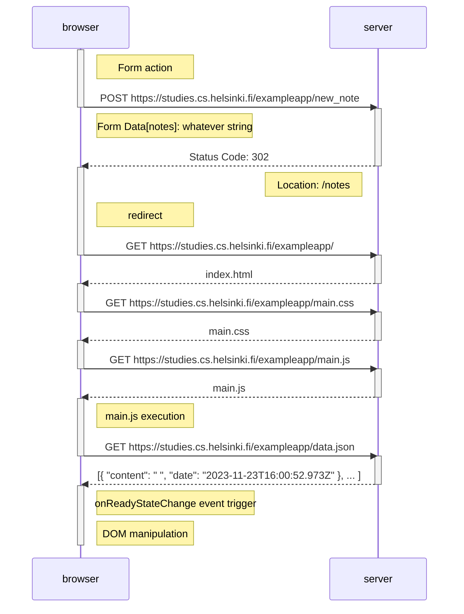

```mermaid
sequenceDiagram
    participant browser
    participant server

    activate browser
    Note right of browser: Form action
    browser->>server: POST https://studies.cs.helsinki.fi/exampleapp/new_note
    deactivate browser

    activate server
    Note right of browser: Form Data[notes]: whatever string
    server-->>browser: Status Code: 302
    deactivate server
    
    activate browser
    Note left of server: Location: /notes
    Note right of browser: redirect
    browser->>server: GET https://studies.cs.helsinki.fi/exampleapp/
    deactivate browser

    activate server
    server-->>browser: index.html
    deactivate server

    activate browser
    browser->>server: GET https://studies.cs.helsinki.fi/exampleapp/main.css
    deactivate browser
    activate server
    server-->>browser: main.css
    deactivate server

    activate browser
    browser->>server: GET https://studies.cs.helsinki.fi/exampleapp/main.js
    deactivate browser

    activate server
    server-->>browser: main.js
    deactivate server

    activate browser
    Note right of browser: main.js execution
    browser->>server: GET https://studies.cs.helsinki.fi/exampleapp/data.json
    deactivate browser

    activate server
    server-->>browser: [{ "content": " ", "date": "2023-11-23T16:00:52.973Z" }, ... ]
    deactivate server

    activate browser
    Note right of browser: onReadyStateChange event trigger
    Note right of browser: DOM manipulation
    deactivate browser
```