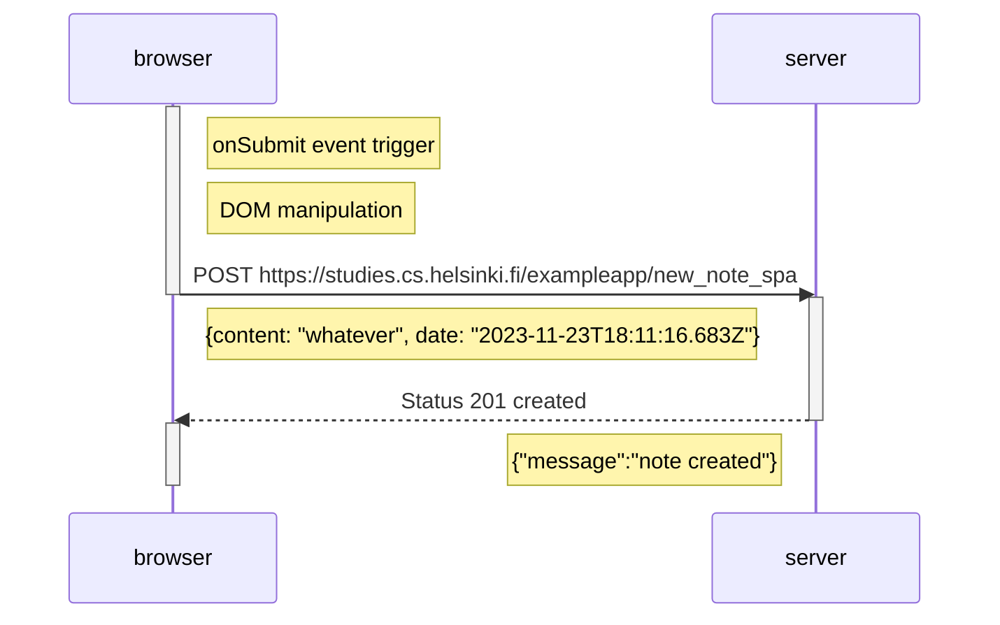

```mermaid
sequenceDiagram
    participant browser
    participant server

    activate browser
    Note right of browser: onSubmit event trigger
    Note right of browser: DOM manipulation
    browser->>server: POST https://studies.cs.helsinki.fi/exampleapp/new_note_spa
    deactivate browser

    activate server
    Note right of browser: {content: "whatever", date: "2023-11-23T18:11:16.683Z"}
    server-->>browser: Status 201 created
    deactivate server

    activate browser
    Note left of server: {"message":"note created"}
    deactivate browser
```